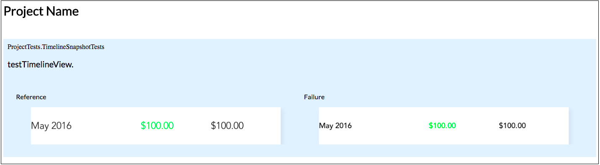

## What is this project?
Turns:
```console

Test Case '-[ProjectTests.TimelineSnapshotTests testTimelineView]' started.
2016-10-09 13:24:47.405 Project[66668:4288774] If you have Kaleidoscope installed you can run this command to see an image diff:
ksdiff "/Users/user/Library/Developer/CoreSimulator/Devices/D44D7153-EC5A-4F31-BAAE-1879B8C830E7/data/Containers/Data/Application/C2792144-5257-43B6-BD9D-9FFE0D1C5FD2/tmp/ProjectTests.TimelineSnapshotTests/reference_testTimelineView@2x.png" "/Users/user/Library/Developer/CoreSimulator/Devices/D44D7153-EC5A-4F31-BAAE-1879B8C830E7/data/Containers/Data/Application/C2792144-5257-43B6-BD9D-9FFE0D1C5FD2/tmp/ProjectTests.TimelineSnapshotTests/failed_testTimelineView@2x.png"
/Users/user/Documents/code/Project/ProjectTests/TimelineTest.swift:54: error: -[ProjectTests.TimelineSnapshotTests testTimelineView] : failed - Snapshot comparison failed: Optional(Error Domain=FBSnapshotTestControllerErrorDomain Code=4 "Images different" UserInfo={NSLocalizedFailureReason=image pixels differed by more than 0.00% from the reference image, FBDiffedImageKey=<UIImage: 0x600000487e40>, {375, 50}, FBReferenceImageKey=<UIImage: 0x608000097e80>, {375, 50}, FBCapturedImageKey=<UIImage: 0x60800009a810>, {375, 50}, NSLocalizedDescription=Images different})
Test Case '-[ProjectTests.TimelineSnapshotTests testTimelineView]' failed (0.029 seconds).
Test Suite 'TimelineSnapshotTests' failed at 2016-10-09 13:24:47.413.
	 Executed 1 test, with 1 failures (0 unexpected) in 0.029 (0.030) seconds
         
```
Into: [Example HTML output](./Example/snapdiff_2016-10-09--12-51-15)


[FBSnapshotTestCase](https://github.com/facebook/ios-snapshot-test-case) is an excellent tool. Unfortunately, its output requires the use of expensive software and is not particularly useful for detecting what broke in a snapshot test whilst running CI. This tool will parse xcodebuild output, detect any failed snapshot tests, and generate human-consumable html output. This output is stored locally so your CI scripts will be able to host in any way they wish, or just store locally.

## What is wrong with existing tools?

|Tool| Description |
|----|-------------|
|[FBSnapshotTestCase](https://github.com/facebook/ios-snapshot-test-case)| Outputs only a Kaleidoscope command, doesn't really do much beyond detecting a failure |
|[ashfurrow/second_curtain](https://github.com/ashfurrow/second_curtain) | A fantastic ruby gem with the exact same purpose as snapdiff, who's only deficiency is that it forces an S3 upload without providing the raw output files for you to host by any other means or inspect locally |
|[orta/Snapshots](https://github.com/orta/Snapshots)| No longer functions after Xcode deprecated plugins. |


## Installation

### Manually

1. `xcodebuild`
2. `cp ./build/Release/snapdiff /usr/local/bin/snapdiff`

### Rake
##### Prerequisite:

```console
$ gem install rake
$ gem install xcpretty
```

##### Then to install:

```console
$ rake make install
```

## Usage

snapdiff will accept input from stdin. This means you can either pipe from xcodebuild directly:
```console
$ xcodebuild | snapdiff 
```

Or output to your home directory, with a custom filename
```console
$ xcodebuild | snapdiff --output-dir=~/ --output-filename=failed-snapshots --color
```

Or output with debugging logs to see why the tool isn't working
```console
$ xcodebuild | snapdiff --color --debug
```

Or `cat` your build output log into snapdiff if you'd prefer to run snapdiff outside of your actual build process

```console
$ xcodebuild > output.log
$ cat output.log | snapdiff
```

### xcpretty

If you are using xcpretty, you must take care to pipe into snapdiff _before_ xcpretty.

## Options

|Arg|Description|Default Value|
|-------------|-------|-------|
|`--output-dir` | Output directory for generated files |`./`|
|`--output-file`| The filename for the actual html file to be output |  `snapdiff-YYYY-MM-DD--hh-ss`|
|`--debug`      | Output debugging information| `disabled` |
|`--color`      | Output debugging and stderr output with ANSI coloring | `disabled`|

### Acknowledgments

Special thanks to:
- Facebook for creating FBSnapshotTestCase, an indispensible tool for reliable iOS development.
- Ash Furrow for creating second_curtain, a large inspiration for this project and an excellent tool.
- Orta for creating everything he makes, including the excellent snapshots Xcode plugin.
